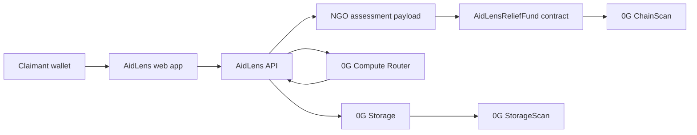

# AidLens

AidLens is an AI-assisted flood relief workflow for the 0G Zero Cup. It lets a claimant submit private damage evidence, asks 0G Compute to triage observable damage with TEE verification, and lets an NGO reviewer make the final onchain payout decision.

> Hackathon prototype: all households, locations, images, narratives, and dashboard metrics are synthetic unless explicitly marked as live onchain artifacts. AidLens is not a production relief, insurance, fraud-detection, or damage-assessment system.


## What AidLens Does

Disaster relief teams often need to move quickly without publishing sensitive evidence from affected households. AidLens demonstrates a privacy-aware review path:

1. A claimant submits flood damage images and an optional voice report.
2. Evidence is encrypted and stored through 0G Storage.
3. 0G Compute runs vision/audio inference and returns a verifiable assessment receipt.
4. Policy code converts severity into a recommended payout.
5. An NGO assessor records the assessment onchain.
6. An NGO reviewer makes the final human decision and approves the native 0G payout.
7. Donors and auditors can inspect redacted roots, transaction links, and public totals without seeing private evidence.

The goal is not to replace human judgment. AidLens is a decision-support layer that keeps evidence private, makes AI use auditable, and leaves relief decisions with trusted reviewers.

## Why 0G

AidLens uses 0G as the core trust layer, not as a decorative integration.

- **0G Storage** stores private evidence bundles and public redacted metadata roots.
- **0G Compute Router** runs the AI triage flow with `verify_tee=true`.
- **0G Galileo testnet** anchors claim state, assessment roots, and payouts.
- **0G ChainScan / StorageScan** provide public audit links for the demo receipts.

In preview mode, AidLens deliberately labels the run as synthetic and non-payable. It does not fake TEE verification or onchain settlement.

## Live Snapshot

- Chain: 0G Galileo testnet, chain id `16602`
- Storage: 0G Galileo Turbo testnet
- Compute: 0G Compute Router
- Vision model: `qwen3-vl-30b`
- Audio model: `whisper-large-v3`
- Contract: [`0x066664cE141ccb20e77bb37ca55E1311254a3780`](https://chainscan-galileo.0g.ai/address/0x066664cE141ccb20e77bb37ca55E1311254a3780)
- Deploy tx: [`0x1dcbc785698cf266f58c3d2f2392c7547195a4a22230f330fe6621bb758b660b`](https://chainscan-galileo.0g.ai/tx/0x1dcbc785698cf266f58c3d2f2392c7547195a4a22230f330fe6621bb758b660b)

Smoke claim #1 was completed end to end:

- Evidence root: `0xc96feef58581f28b61c44f67d72714d68bdf73851f9b3bf1f3e1787010729a71`
- Public metadata root: `0x462c4041f43eab7b533daa9c9cc5ca06d56990f08c9fb68bb221e11e15ad835f`
- Assessment root: `0x4231a0b215f99c248c31b9eb0ad53dd5b4ee16bf57ed8250aaa56cdb4c826f52`
- Receipt hash: `0x6c539eb9846174edccfe726541e0262b0fcffa4a06f6162c26bcf410c8b34ddf`
- Submit tx: [`0x63db31e39813d806e26d8b15dd8993de78982ad98df4d952e477a8e6687ae484`](https://chainscan-galileo.0g.ai/tx/0x63db31e39813d806e26d8b15dd8993de78982ad98df4d952e477a8e6687ae484)
- Assessment tx: [`0xe792f0586ed06e7ced40ea319b9b93cc4d00f34f51944bcaf7efe06281e4f881`](https://chainscan-galileo.0g.ai/tx/0xe792f0586ed06e7ced40ea319b9b93cc4d00f34f51944bcaf7efe06281e4f881)
- Payout tx: [`0xb946495f8bd0ce7c316fdbddda57790aface34c70742a558e56d2030b02eeb83`](https://chainscan-galileo.0g.ai/tx/0xb946495f8bd0ce7c316fdbddda57790aface34c70742a558e56d2030b02eeb83)

The smoke payout used a small reviewer override amount because the demo contract was funded with `1 0G`.

## Product Walkthrough

### Claimant

The claimant opens `/claim`, connects a wallet, fills in household and district details, uploads evidence, and signs an expiring evidence manifest. When live 0G configuration is available, the app waits for the `ClaimSubmitted` event and stores the real onchain claim id for the browser session.

### NGO Assessor

The NGO workspace at `/ngo` lets an assessor select the latest submitted claim, run the 0G Compute assessment, review the TEE receipt status, and record the assessment root onchain.

### NGO Reviewer

After assessment, a reviewer can approve payout, request more information, or reject the claim. The smart contract enforces roles, status transitions, payout caps, and double-payout prevention.

### Public Transparency

The `/transparency` page shows redacted public outcomes and live contract totals when the contract is configured. Private evidence, transcripts, exact GPS, health details, encryption keys, and raw media are never exposed in the public receipt.

## Architecture

```text
apps/web
  React 19, Vite, TypeScript, Tailwind, shadcn/ui, wagmi, viem, MapLibre

apps/api
  Fastify, Zod, multipart evidence upload, 0G Storage adapter, 0G Compute adapter

contracts
  Solidity 0.8.24, Foundry, AidLensReliefFund
```

The contract is the source of claim and treasury state. Evidence and assessments live on 0G Storage. The app does not use a database.



## Smart Contract

`AidLensReliefFund` supports the full relief lifecycle:

```solidity
donate()
submitClaim(evidenceRoot, publicRoot, districtCode)
replaceEvidence(claimId, evidenceRoot)
recordAssessment(claimId, assessmentRoot, receiptHash, severity, recommendedAmount)
requestMoreInfo(claimId, noteHash)
approveAndPay(claimId, amount, reviewNoteHash)
rejectClaim(claimId, reasonHash)
cancelClaim(claimId)
```

Roles:

- `DEFAULT_ADMIN_ROLE`
- `ASSESSOR_ROLE`
- `REVIEWER_ROLE`

Claim statuses:

```text
0 Submitted
1 Assessed
2 NeedsInfo
3 Paid
4 Rejected
5 Cancelled
```

Safety checks include role enforcement, valid state transitions, duplicate evidence-root prevention, payout caps, insufficient-balance checks, checks-effects-interactions, and a reentrancy guard.

## API Surface

- `GET /health`
- `GET /v1/0g/status`
- `POST /v1/evidence`
- `POST /v1/assessments`

`POST /v1/evidence` validates the claimant signature, uploads private evidence and public metadata, and returns roots for the onchain claim.

`POST /v1/assessments` requires an assessor signature, downloads/decrypts evidence, runs 0G Compute, uploads the assessment receipt, and returns the payload needed to record the result onchain.

## Run Locally

Requirements:

- Node.js 22+
- pnpm 10+
- Foundry

Install and start both apps:

```bash
pnpm install
pnpm dev
```

Open:

- Web app: `http://localhost:5173`
- API: `http://localhost:8787`

Without live secrets, the API falls back to in-memory storage and deterministic synthetic assessment. That mode is useful for UI review, but it cannot create a live 0G assessment or payout.

Run checks:

```bash
pnpm typecheck
pnpm --filter @aidlens/web lint
pnpm test
pnpm build
```

Check service mode:

```bash
curl -s http://localhost:8787/v1/0g/status | jq
```

## Configuration

Server environment variables:

- `ZERO_G_COMPUTE_API_KEY`
- `ZERO_G_COMPUTE_BASE_URL`
- `ZERO_G_VISION_MODEL`
- `ZERO_G_AUDIO_MODEL`
- `ZERO_G_RPC_URL`
- `ZERO_G_MAINNET_RPC_URL`
- `ZERO_G_STORAGE_INDEXER`
- `ZERO_G_SERVICE_PRIVATE_KEY`
- `RELIEF_FUND_ADDRESS`
- `NGO_ENCRYPTION_PRIVATE_KEY`
- `WEB_ORIGIN`

Web environment variables:

- `VITE_API_URL`
- `VITE_0G_CHAIN_ID`
- `VITE_0G_RPC_URL`
- `VITE_RELIEF_FUND_ADDRESS`
- `VITE_NGO_ENCRYPTION_PUBLIC_KEY`

Generate browser encryption keys:

```bash
pnpm keys:encryption
```

The browser encryption path uses AES-256-GCM for evidence content and ECDH P-256 + HKDF to seal the content key for the NGO worker. If the browser public key is not configured, AidLens uses the server-side snapshot path and labels the active trust boundary in the UI.

## Deploy Notes

Deploy the web app from `apps/web` with only `VITE_*` variables exposed to the browser. Deploy the API separately and keep all server secrets out of the frontend bundle.

The repository includes:

- `apps/web/vercel.json` for the Vite frontend.
- `railway.json` and `apps/api/Dockerfile` for the Fastify API.
- Foundry scripts under `contracts/script`.

To deploy the contract from `contracts/`:

```bash
set -a
source ../.env
set +a
export DEPLOYER_PRIVATE_KEY="$ZERO_G_SERVICE_PRIVATE_KEY"
export AIDLENS_ADMIN_ADDRESS=$(cast wallet address --private-key "$ZERO_G_SERVICE_PRIVATE_KEY")
forge script script/Deploy.s.sol:DeployAidLens --rpc-url "$ZERO_G_RPC_URL" --broadcast
```

## Privacy And Trust Boundary

AidLens treats TEE verification as proof about the model inference path, not proof that the entire web app, backend, wallet, or human review process ran inside a TEE.

The demo receipt records whether the 0G Router reported TEE verification and whether the independent SDK verification attempt succeeded. In the current smoke run, the Router returned `tee_verified=true`; the independent SDK lookup could not retrieve a public provider signature and is recorded as unavailable. The app therefore presents the run as Router-verified, not as independently SDK-verified.

Human reviewers remain responsible for every payout decision.

## Repository Hygiene

- `.env` files are intentionally ignored.
- Generated build outputs, Foundry cache, and local video assets are not part of the committed source snapshot.
- Public project assets live in `apps/web/public/brand`.

## Useful References

- [0G Router overview](https://docs.0g.ai/developer-hub/building-on-0g/compute-network/router/overview)
- [0G Router verifiable execution](https://docs.0g.ai/developer-hub/building-on-0g/compute-network/router/features/verifiable-execution)
- [0G Direct inference and `processResponse`](https://docs.0g.ai/developer-hub/building-on-0g/compute-network/inference)
